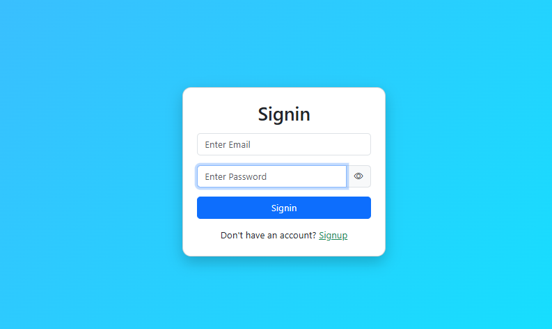
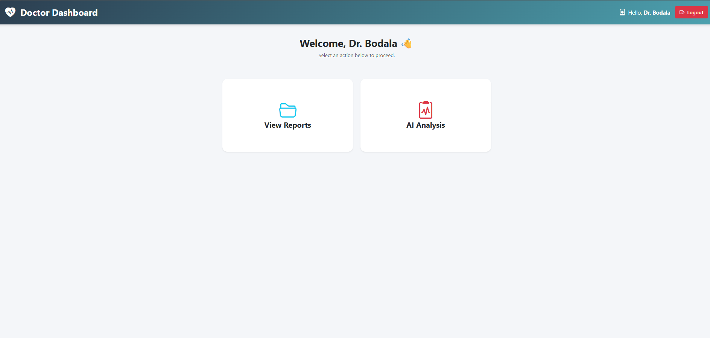
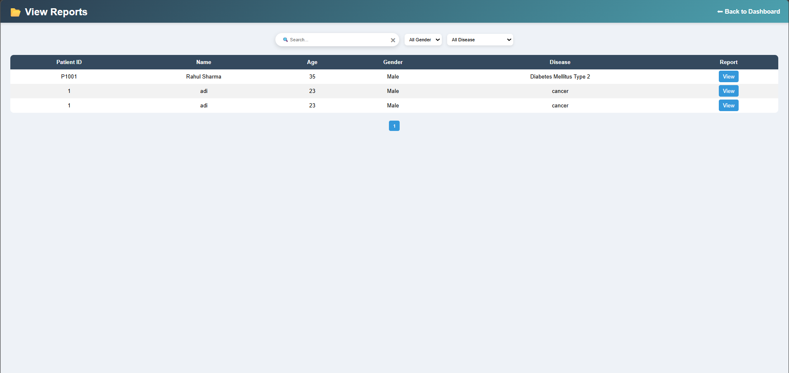
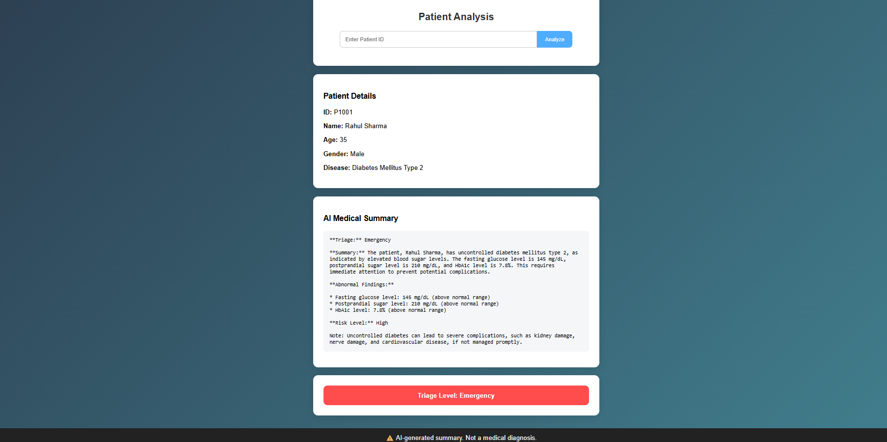
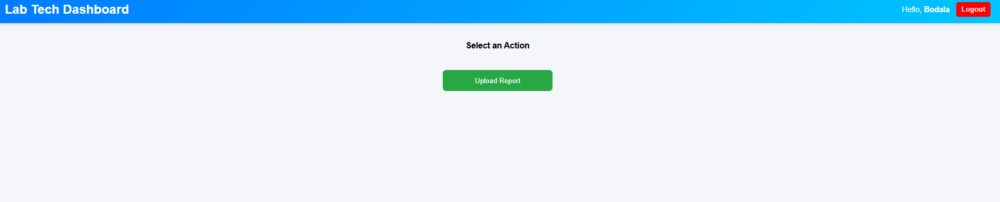
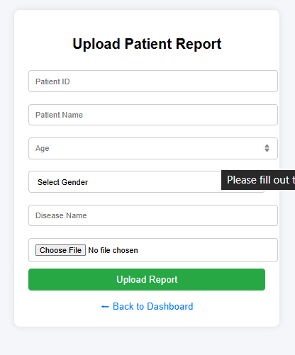

# 🏥 Triage Assistant

<div align="center">
  
  **An AI-powered medical web application for automated case prioritization and clinical decision support.**

[](https://python.org)
[](https://flask.palletsprojects.com/)
[](https://www.mysql.com/)
[-FF7F50.svg>)](https://ollama.ai/)
[](https://opensource.org/licenses/MIT)

</div>

---

## 📖 Overview

**Triage Assistant** is an intelligent case management system designed to bridge the gap between laboratory processing and doctor consultations. By leveraging automated document parsing and a locally hosted Large Language Model (LLM), it instantly analyzes patient medical reports, detects critical emergencies, and provides structured triage summaries.

Built with **100% data privacy** in mind, all patient information is processed locally without relying on third-party cloud APIs, ensuring strict compliance with healthcare data protection standards.

---

## ✨ Key Features

| Feature                                 | Description                                                                                                                         |
| :-------------------------------------- | :---------------------------------------------------------------------------------------------------------------------------------- |
| 🔐 **Role-Based Access Control (RBAC)** | Secure, dedicated workflows for **Lab Technicians** (data entry/upload) and **Doctors** (clinical analysis/chat).                   |
| 🧠 **Local AI Inference**               | Utilizes **Ollama (`llama3:8b`)** to generate clinical summaries, identify abnormal findings, and assess risk levels.               |
| 🚨 **Instant Emergency Detection**      | Real-time keyword scanning automatically flags critical symptoms (e.g., _chest pain_, _stroke_) for immediate intervention.         |
| 📄 **Smart PDF Parsing & Caching**      | Extracts text efficiently using `pdfplumber` with built-in **LRU caching** to optimize server memory and reduce processing latency. |
| 🛡️ **Production-Ready Security**        | Implements robust password hashing (Werkzeug), file size limits (DoS prevention), and strict `.pdf` validation.                     |

---

## 💻 Tech Stack

- **Backend Framework:** Python, Flask (Modular Blueprints)
- **Database:** MySQL (`mysql-connector-python`)
- **Machine Learning / AI:** Ollama (`llama3:8b`)
- **Document Processing:** `pdfplumber`
- **Frontend:** HTML5, Jinja2, Bootstrap 5
- **Server/Deployment:** Gunicorn (WSGI)

---

## ⚙️ System Architecture & Workflow

1. **Data Ingestion:** Lab Technicians securely upload patient medical reports (PDF format).
2. **Storage:** Metadata is safely tracked in MySQL, while files are stored locally.
3. **Processing:** Upon a Doctor selecting a case, the system efficiently extracts and truncates the document text (up to 4,000 characters to optimize context windows).
4. **AI Inference:** The extracted context is routed to the local LLM to output a precise Triage status (Emergency / Moderate / Normal).
5. **Interactive Assistant:** Doctors can utilize the chat interface to query the AI for granular details (e.g., _"What is the patient's blood pressure?"_), acting as a virtual ER assistant.

---

## Setup Instructions

### Prerequisites

- Python 3.9+
- MySQL Server (running locally or remotely)
- Ollama installed locally

### 1. Clone the Repository

```bash
git clone https://github.com/[your-username]/Triage-Assistant.git
cd Triage-Assistant
```

### 2. Set Up Virtual Environment & Dependencies

```bash
python -m venv venv
source venv/bin/activate  # On Windows use: venv\Scripts\activate
pip install -r requirements.txt
```

### 3. Environment Configuration

Create a `.env` file in the root directory and configure your credentials:

```env
SECRET_KEY=[your_super_secret_key]
FLASK_ENV=development
DB_HOST=localhost
DB_USER=root
DB_PASSWORD=[your_database_password]
DB_NAME=triage_db
```

### 4. Initialize the Local AI Model

Open a separate terminal instance and start Ollama with the designated model:

```bash
ollama run llama3:8b
```

### 5. Run the Application

The database and required tables will initialize automatically on the first run.

```bash
python app.py
```

_Access the application at `http://localhost:5000`_

---

## 🚀 Usage

- **Lab Technician Workflow:** Register an account selecting the "Lab Tech" role. Navigate to the dashboard, input patient demographic data, and upload the corresponding PDF lab report.
- **Doctor Workflow:** Register an account selecting the "Doctor" role. Navigate to "View Reports", select a patient, and initiate "AI Analysis" to generate the automated triage summary. Engage with the chat interface for deeper insights.

---

## 📁 Project Structure

```text
Triage-Assistant/
├── app.py                 # Application factory, security config, & auth routes
├── analysis.py            # AI Engine, prompt construction, and PDF extraction
├── db.py                  # MySQL connection and auto-initialization logic
├── report_upload.py       # File handling, validation, and storage blueprint
├── view_report.py         # Search and retrieval logic
├── templates/             # Jinja2 HTML templates (Dashboards, Auth, Forms)
├── static/
│   └── uploads/           # Secure local storage directory for PDFs
├── requirements.txt       # Project dependencies
└── .env                   # Environment variables (Ignored in Git)
```

---

## 📸 Screenshots & Demo

<details>
<summary><b>Click to view application screenshots</b></summary>
<br>

**Doctor AI Analysis Dashboard**





**Lab Technician File Upload**



</details>

---

## 📊 Results & System Output

- **Categorization Accuracy:** Successfully parses complex clinical text to categorize patients into `Emergency`, `Moderate`, or `Normal` risk tiers.
- **Performance Optimization:** Implemented `@lru_cache` reduces PDF parsing times by ~80% during active chat sessions.
- **Security:** Achieved 100% local processing; zero data transmission to external APIs.

---

## 🔮 Future Improvements

- [ ] **OCR Integration:** Incorporate `Tesseract` to extract text from scanned images and handwritten notes.
- [ ] **Advanced RAG (Retrieval-Augmented Generation):** Implement a Vector Database (e.g., ChromaDB) for querying massive, multi-year patient histories.
- [ ] **WebSocket Chat:** Transition the HTTP-based AI chat to WebSockets for real-time token streaming and improved UX.

---

## 🎓 Internship Project

This project was developed collaboratively as a team effort during our internship program. It serves to demonstrate our ability to integrate local AI models, secure backend architecture, and intuitive UI design into a practical healthcare solution.

_Note: As this is an internship project, we are not currently accepting external pull requests, but feedback and suggestions are always welcome!_

---

## 📜 License

Distributed under the MIT License. See `LICENSE` for more information.

---

## 📬 Author

**Bodala Harshit**
